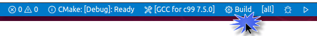

# C++ tools installation guide for Mac

Main external source of info: [https://code.visualstudio.com/docs/cpp/config-clang-mac
](https://code.visualstudio.com/docs/cpp/config-clang-mac

Follow the steps at the beginning of the page:

1. Install VS Code - [https://code.visualstudio.com/download](https://code.visualstudio.com/download)
2. Install C/C++ extension from within VS Code.
3. Install `clang` or make sure it's already installed

### Installing clang

Open Terminal, write `clang --version`.

If clang isn't installed, write `xcode-select --install`.

## CMake

1. Install CMake (Binary distributions) - [https://cmake.org/download/](https://cmake.org/download/)
2. Install "CMake Tools" extension from within VS Code.

### Test your installation

1. Make an empty folder
2. Open VS Code in that folder
   - Open VS Code.
   - Select "Open Folder..."
   - Select your folder
3. Press `Cmd+Shift+P`. Write `cmake:quick start` - the option should appear as you're writing, select it.
4. Write the name of your project
5. Select "executable"
6. Click "select a kit" at the bottom of the screen, or `Cmd+Shift+P` - "cmake:select a kit".
7. Select the latest available version of *clang*.

You should be ready to build your project

Run the project by clicking the triangle button on the right.
