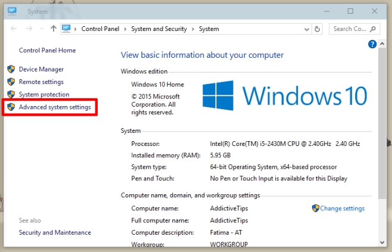
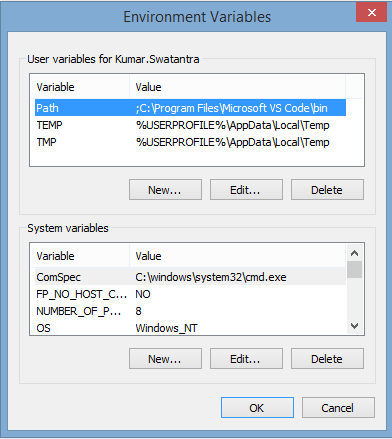

# C++ tools installation guide for Windows

Main external source of info: [https://code.visualstudio.com/docs/cpp/config-mingw](https://code.visualstudio.com/docs/cpp/config-mingw)

Follow the steps at the beginning of the page:

1. Install VS Code - [https://code.visualstudio.com/download](https://code.visualstudio.com/download)
2. Install C/C++ extension from within VS Code.
3. Install MSYS2 - [https://www.msys2.org/](https://www.msys2.org/)
   - Use the default installation path
4. You should see a terminal window after installation. Run the command `pacman -S --needed base-devel mingw-w64-x86_64-toolchain`. Select "Yes" for everything.

Add path to your MinGW installation to the environment variable `PATH`.

### Changing `PATH`

Select "Advanced system settings"

Select "Environment Variables"

Select "Path" in the top section - "User variables". If there is no variable "Path", add a new one.

Select "Edit" and add `C:\msys64\mingw64\bin` (or the path you selected when installing MSYS2).

## CMake

1. Open MSYS2
2. Run the command `pacman -S mingw-w64-x86_64-cmake`

### Test your installation

1. Make an empty folder
2. Open VS Code in that folder
   - For example, open terminal in the folder (Shift + Right Click, then "Open PowerShell here") and enter `code .` (with the dot at the end).
3. Press `Ctrl+Shift+P`. Write `cmake:quick start` - the option should appear as you're writing, select it.
4. Write the name of your project
5. Select "executable"
6. Click "select a kit" at the bottom of the screen, or `Ctrl+Shift+P` - "cmake:select a kit".
7. Select the latest available version of GCC / MinGW.

You should be ready to build your project

Run the project by clicking the triangle button on the right.
